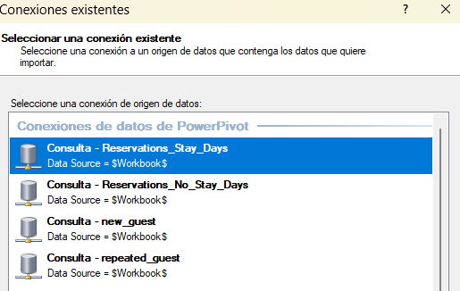
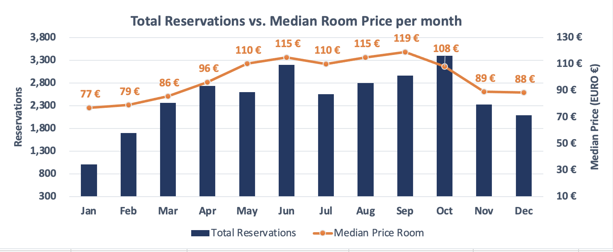
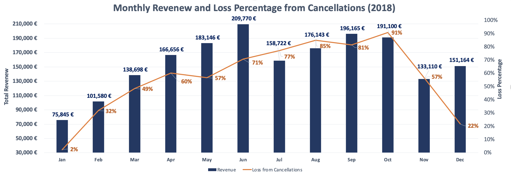
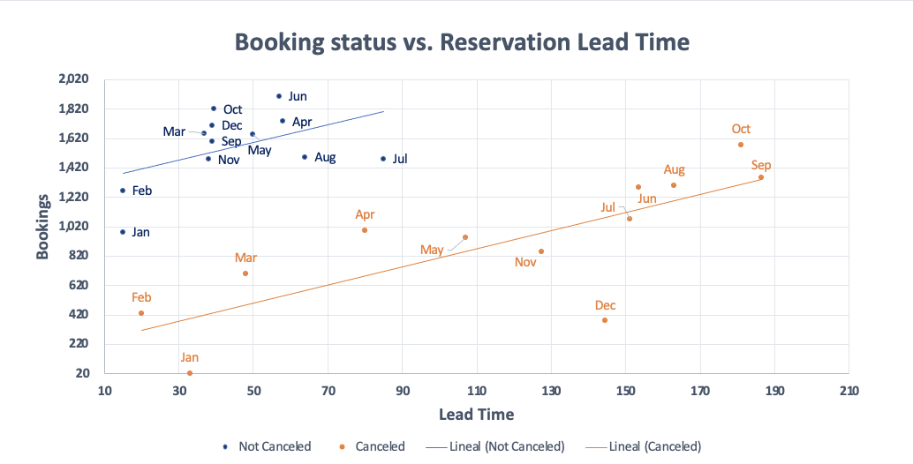
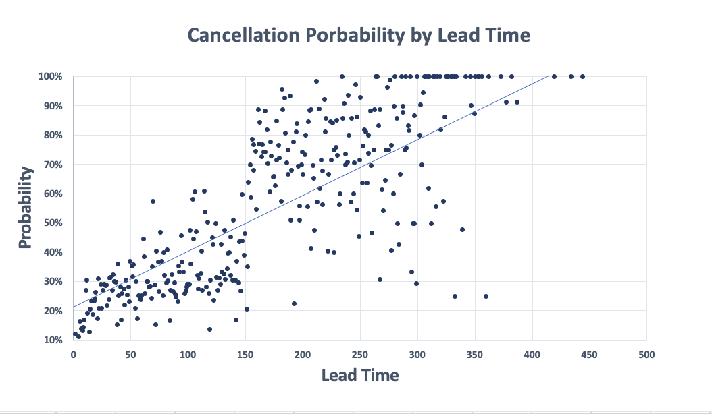
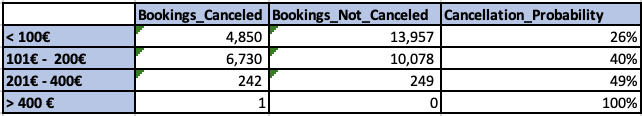
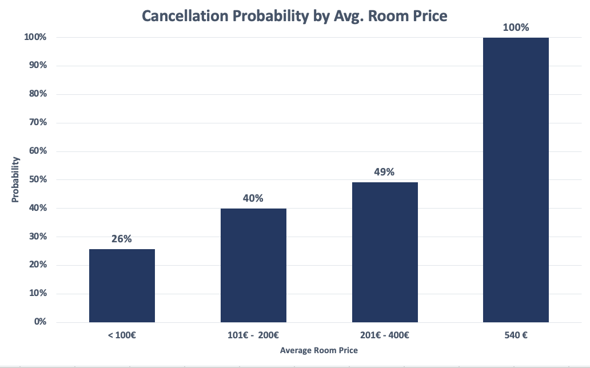
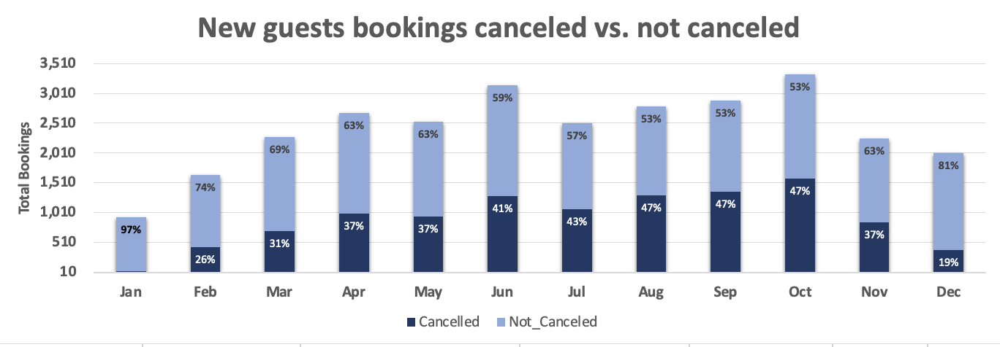
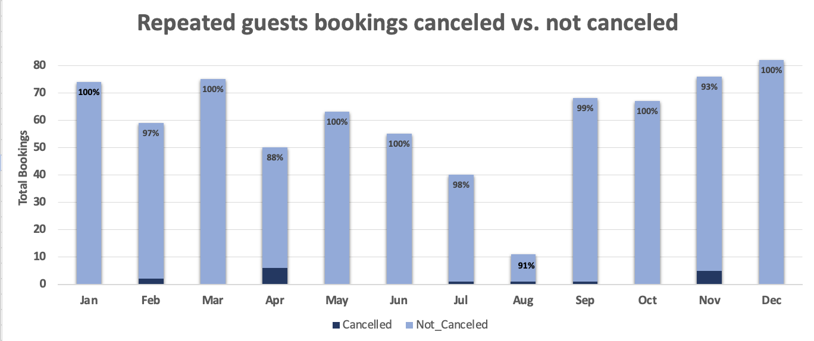

# Hotel Booking Cancellation Analysis

### Objective
This analysis aims to explore hotel booking data, focusing on understanding cancellation rates, their impact on revenue, and key drivers for cancellations. The insights derived from this analysis are aimed at identifying strategies to minimize cancellations and improve revenue streams for the hotel.

### Questions to Analyze

1. What are the months with the highest average price and the highest number of bookings?
2. How do cancellations impact monthly revenue and the percentage of revenue lost throughout the year?
3. How does reservation lead time affect booking status (canceled vs. not canceled)?
4. How does room price influence the probability of cancellation?
5. How does the cancellation rate relative to canceled bookings differ between new and repeated guests?

### Excel Skills Used
The following Excel skills were utilized for analysis:

* 📊 Pivot Tables 
* 📈 Pivot Charts 
* 🧮 DAX (Data Analysis Expressions) 
* 🔍 Power Query 
* 💪 Power Pivot 

### Hotel Reservations Dataset
The dataset used for this project  is available via Kaggle: [Hotel Reservations Dataset by Ahsan Raza](https://www.kaggle.com/datasets/ahsan81/hotel-reservations-classification-dataset). It includes detailed information on:

* 👨‍💼 Booking ID, date and status 
* 💰 Average Room Prices 
* 🏨 Room Type and Segment Type 
* 👥 Guests

## 🔍 Power Query (ETL) and DAX Integration: Data Extraction, Transformation, and Analysis

📥 **Extract**: I first used Power Query to extract the original data (`Hotel_Bookings.xlsx`), filtering for the year 2018 and selecting data with complete information, specifically filtering the `stay_days` column to exclude entries with 0 days. This ensured that the data I worked with was relevant and accurate.

🔄 **Transform**: After extracting the data, I transformed the query by adjusting column types, removing unnecessary columns, and adding new ones relevant for analysis. I also cleaned the text by removing specific unwanted words and trimming excess whitespace. This helped to standardize the dataset and improve its usability for analysis.

📊 **Reservations_Stay_Days**


🔗 **Load**: Finally, I loaded both transformed queries into the workbook, setting the foundation for my subsequent analysis.

🔀 **Integrating Power Query with Power Pivot for DAX Calculations**: To further enhance the analysis, I connected the transformed data in Power Query to Power Pivot, enabling advanced calculations using DAX. This allowed me to create powerful metrics, aggregations, and pivot tables to gain deeper insights into the hotel bookings data.



  
## 📊Analysis

## 1️⃣ What are the months with the highest average price and the highest number of bookings?

### 📈Pivot Table
* 📊 I moved the `month_name` to the rows area, `total_reservations` and `median_price_room` into the values area.

### 🧮 DAX
* To calculate the `median_price_room` each month I used DAX.

```
Median Price Room := MEDIAN(Reservation_Stay_Days[avg_price_per_room])
```

### 💡 Insights
* **October** has the highest number of bookings, with more than 3,300 reservations, indicating peak demand during this month.
* **June** follows closely with a median price of 115€,  indicating a strong season but with a slightly lower average price compared to **September**.
* **September** has the highest median room price, at 119€ which is higher than the other months.



### 🤔 So What
* **October** leads in bookings, while **September** sees the highest room prices, indicating different strategies for peak seasons. **October** likely represents the volume-driven peak, while **September** may focus on higher-value bookings.

## 2️⃣ How do cancellations impact monthly revenue and the percentage of revenue lost throughout the year?

### 📈Pivot Table
* 📊 I moved the `booking_status` (Canceled and Not Canceled) and `month_name` to the rows area, and the `total_revenue` into the values area.

### 🧮 DAX
* To calculate the `total_revenue` for each month:

```
Total revenue := [Median Price Room]*COUNT(Reservation_Stay_Days[Booking_ID])
```
* To calculate the `loss_percentage` from cancellations for each month:

```
Loss from Cancellations := 
DIVIDE(
    CALCULATE([Total Revenue], Reservation_Stay_Days[booking_status] = "Canceled"), 
    CALCULATE([Total Revenue], Reservation_Stay_Days[booking_status] = "Not_Canceled"),
    0
)
```

### 💡 Insights

* **June** achieves the highest revenue, with strong bookings (almost as many as **October**), but its cancellation rate is much lower (71%) compared to October's 91%. This indicates that while **October** has a higher volume of bookings, it also experiences significantly more cancellations, affecting overall revenue. It benefits from a more stable cancellation rate, which allows for more consistent revenue generation.

* **October**, with the highest number of bookings, likely benefits from a higher volume-driven strategy, but the 91% cancellation rate suggests that more cancellations are reducing its potential revenue. The high volume in October could be a risk if not managed with strategies to reduce cancellations.

* **September** sees the highest median room price (€119) but also a high cancellation rate (81%). This suggests that higher room prices attract premium customers, but cancellations still affect revenue.




### 🤔 So What

* **October** has the highest bookings but also the highest cancellation rate, impacting revenue. June, with fewer cancellations, generates more stable revenue despite lower bookings. Focusing on reducing cancellations, especially in high-demand months like October, could optimize revenue.

## 3️⃣ How does reservation lead time affect booking status (canceled vs. not canceled)?

### 📈Pivot Table
* 📊 I moved the `booking_status` (Canceled and Not Canceled) and `month_name` to the rows area, `total_bookings_count` and `median_lead_time` into the values area.

### 🧮 DAX
* To calculate the `median_lead_time` for each month:

```
Median Lead Time := MEDIAN(Reservation_Stay_Days[lead_time])
```
* To calculate the `cancellation_probability`:

```
  Cancellation Probability := 
    DIVIDE(
        SUM(Reservation_Stay_Days[Canceled]), 
        SUM(Reservation_Stay_Days[Canceled]) + SUM(Reservation_Stay_Days[Not_Canceled])
    )
```

### 💡 Insights
* Reservation lead time is positively correlated with cancellations. As the lead time increases, the probability of cancellation rises.

* **September** and **October** show the highest lead times and cancellations. These months have longer booking periods, but they also show higher cancellations.

* **February**, **January** and **March** have low lead times and cancellations, indicating that shorter booking windows are associated with fewer cancellations.

* The not canceled bookings tend to cluster around lower lead times, showing that guests with short-term bookings are more likely to stick to their reservations.





### 🤔 So What
* Longer lead times result in a higher likelihood of cancellations, which suggests that strategies such as reducing lead times or offering incentives to prevent cancellations could be considered, especially for months like **September** and **October**.

* Shorter lead times are associated with more stable bookings, which could help forecast and plan more effectively for high-demand months with fewer cancellations.

## 4️⃣  How does room price influence the probability of cancellation?

### 📈Pivot Table
* 📊 I moved the `average_price_room` to the rows area, `canceled` and `not_canceled` into the values area.

### 💲 Price Bucket

* For the purpose of analyzing cancellation probabilities based on room prices, I divided the average room prices into distinct buckets to capture trends across different pricing segments. The chosen price ranges are as follows:




### 💡 Insights
* As room price increases, the cancellation probability rises. Rooms priced between 201€ and 300€ have the highest cancellation probability at 49%, while rooms under 100€ have the lowest at 26%.

* Rooms priced between 101€ and 200€ show a cancellation probability of 40%.

* A room priced at >400€ (540€) shows a 100% cancellation rate, but this is based on a very small sample.



### 🤔 So What
* Understanding that higher-priced rooms are more likely to be canceled can help in refining cancellation policies and forecasting revenue.

## 5️⃣ How does the cancellation rate relative to canceled bookings differ between new and repeated guests?

### 📈Pivot Table
* 📊 I moved the `month_name` to the rows area, `Canceled` and `Not_Canceled` into the values area.

### 🧮 DAX
* To calculate the `canceled` cancellation rate for each month:

```
Cancellation Rate := 
    DIVIDE(SUM(Reservation_Stay_Days[Canceled]), SUM(Reservation_Stay_Days[Canceled]) + SUM(Reservation_Stay_Days[Not_Canceled]))
```
* To calculate the `Not_Canceled` not cancellation rate for each month:

```
Not Cancellation Rate := 
    DIVIDE(SUM(Reservation_Stay_Days[Not_Canceled]), SUM(Reservation_Stay_Days[Not_Canceled]) + SUM(Reservation_Stay_Days[Canceled]))
```


### 💡 Insights

### For New Guests:

* New guests make up the majority of reservations throughout the year. As the year progresses, the cancellations begin to increase between second and third quarter.

* New guests, despite making up the majority of bookings, tend to cancel more frequently. This suggests that new bookings are more uncertain and subject to higher cancellations.

### For Repeated Guests:

* Repeated guests, while having lower cancellations, represent a much smaller proportion of the total bookings. In general 80% to 100% of bookings were not canceled throughout the year, but these had fewer total bookings overall.

* Repeated guests, though fewer in number, show much lower cancellations, indicating higher loyalty and reliability when it comes to keeping bookings.




### 🤔 So What
* The majority of bookings come from new guests, whose higher cancellations highlight the importance of improving retention efforts. For repeated guests, focusing on maintaining loyalty can further decrease cancellations and ensure a steady stream of confirmed bookings.

## Conclusion

This project analyzed hotel booking and cancellation data to uncover trends in booking behaviors. Using Power BI, DAX, and Power Query, I explored how factors like room price, lead time, and guest type influence cancellation rates and revenue. Key insights include that higher room prices lead to higher cancellation rates, and new guests tend to cancel more often than repeated guests.

These findings offer actionable insights for optimizing pricing strategies and reducing cancellations, which can help improve revenue. This analysis serves as a practical example for professionals in the hospitality and data analysis sectors, providing valuable strategies for better decision-making.
