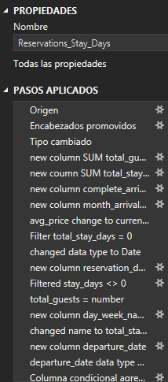

# Hotel Booking Cancellation Analysis

### Objective
This analysis aims to explore hotel booking data, focusing on understanding cancellation rates, their impact on revenue, and key drivers for cancellations. The insights derived from this analysis are aimed at identifying strategies to minimize cancellations and improve revenue streams for the hotel.

### Questions to Analyze

1. What are the months with the highest average price and the highest number of bookings?
2. How do cancellations affect monthly revenue and loss percentages throughout the year?
3. How does reservation lead time affect booking status (cancelled vs. not cancelled)?
    3.1 How does lead time affect the probability of cancellation?
4. How does reservation room price affect booking status (cancelled vs. not cancelled)?
    4.1 How does room price influence the probability of cancellation?
5. How do cancellation rates differ between new and repeated guests?

### Excel Skills Used
The following Excel skills were utilized for analysis:

* 📊 Pivot Tables 
* 📈 Pivot Charts 
* 🧮 DAX (Data Analysis Expressions) 
* 🔍 Power Query 
* 💪 Power Pivot 

### Hotel Reservations Dataset
The dataset used for this project  is available via my Kaggle: [Hotel Reservations Dataset by Ahsan Raza](https://www.kaggle.com/datasets/ahsan81/hotel-reservations-classification-dataset). It includes detailed information on:

* 👨‍💼 Booking ID, date and status 
* 💰 Average Room Prices 
* 🏨 Room Type and Segment Type 
* 👥 Guests

## 🔍 Power Query (ETL) and DAX Integration: Data Extraction, Transformation, and Analysis

📥 **Extract**: I first used Power Query to extract the original data (Hotel_Bookings.xlsx), filtering for the year 2018 and selecting data with complete information, specifically filtering the stay_days column to exclude entries with 0 days, as these were not logical. This ensured that the data I worked with was relevant and accurate.

🔄 **Transform**: After extracting the data, I transformed the query by adjusting column types, removing unnecessary columns, and adding new ones relevant for analysis. I also cleaned the text by removing specific unwanted words and trimming excess whitespace. This helped to standardize the dataset and improve its usability for analysis.

📊 Reservations_Stay_Days

🔗 **Load**: Finally, I loaded both transformed queries into the workbook, setting the foundation for my subsequent analysis.

🔀 **Integrating Power Query with Power Pivot for DAX Calculations**: To further enhance the analysis, I connected the transformed data in Power Query to Power Pivot, enabling advanced calculations using DAX. This allowed me to create powerful metrics, aggregations, and pivot tables to gain deeper insights into the hotel bookings data.

  
## 📊Analysis

### 1️⃣ What are the months with the highest average price and the highest number of bookings?

* October has the highest number of bookings, with more than 3,300 reservations, indicating peak demand during this month.
* June follows closely with a median price of 115€,  indicating a strong season but with a slightly lower average price compared to September.
* September has the highest median room price, at 119€ which is higher than the other months.

### 🤔 So What
* October leads in bookings, while September sees the highest room prices, indicating different strategies for peak seasons. October likely represents the volume-driven peak, while September may focus on higher-value bookings.

### 2️⃣ How do cancellations affect monthly revenue and loss percentages throughout the year?

